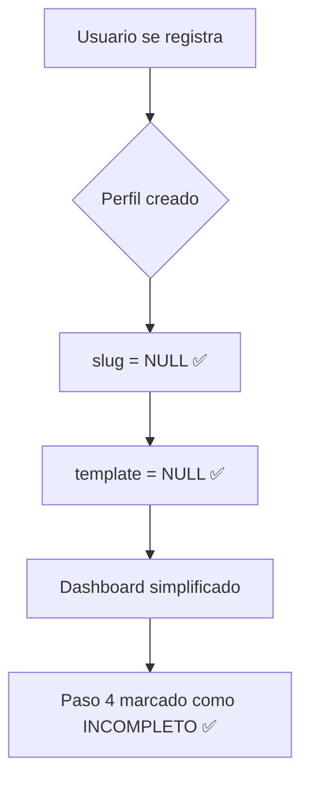
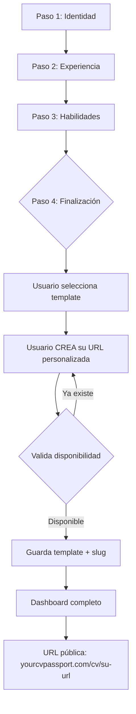

# Fix: Prevención de Asignación Automática de Slugs (SEO)

## Fecha
2026-01-09

## Problema

**Los usuarios están recibiendo URLs automáticamente al registrarse**, lo cual:

1. ❌ **Viola el flujo del wizard**: El usuario debe crear su URL al FINALIZAR el wizard, no al registrarse
2. ❌ **Afecta el SEO**: URLs vacías (sin contenido) indexadas por buscadores
3. ❌ **Confunde al usuario**: El dashboard marca el paso 4 como completado cuando no debería

### Ejemplo del Problema

```
Usuario se registra → Recibe slug automático: "user-3bce51c1"
Dashboard muestra:
✅ Choose template and URL → ✓ user-3bce51c1

Pero el usuario NUNCA eligió esa URL!
```

## Causa Raíz

La función `on_profiles_created_sync_email` tiene código que asigna slugs automáticamente:

```sql
-- ❌ CÓDIGO PROBLEMÁTICO:
UPDATE profiles
SET email = (SELECT email FROM auth.users WHERE id = NEW.id LIMIT 1),
    slug = COALESCE(NEW.slug, 'user-' || substring(NEW.id::text from 1 for 8))
WHERE id = NEW.id;
```

Este trigger se ejecuta **AFTER INSERT**, por lo que asigna el slug automáticamente después de que el usuario se registra.

## Solución

### Paso 1: Ejecutar Diagnóstico (Opcional pero Recomendado)

Antes de aplicar el fix, ejecuta el diagnóstico para confirmar el problema:

1. Ve a **Supabase Dashboard** → SQL Editor
2. Copia y pega el contenido de: [scripts/sql/EJECUTAR_ESTE_DIAGNOSTICO.sql](../../scripts/sql/EJECUTAR_ESTE_DIAGNOSTICO.sql)
3. Ejecuta
4. Observa el resultado del test:
   - ✅ `slug = NULL` → La BD está correcta (problema en app)
   - ❌ `slug = user-xxxxx` → La BD está asignando slugs automáticamente (ESTE ES TU CASO)

### Paso 2: Aplicar la Migración

1. Ve a **Supabase Dashboard** → SQL Editor
2. Copia y pega **COMPLETO** el contenido de: [supabase/migrations/20260109_fix_slug_seo_workflow.sql](../../supabase/migrations/20260109_fix_slug_seo_workflow.sql)
3. Click **Run**
4. Verifica que aparezcan mensajes como:
   ```
   ✅ Trigger prevent_auto_slug_trigger está ACTIVO
   ✅ CORRECTO: Slug es NULL para nuevo usuario
   ```

### Paso 3: Verificar la Corrección

**Crear un usuario de prueba:**

1. Abre una ventana de incógnito
2. Registra un nuevo usuario de prueba: `test-seo-fix@dev.com`
3. Ve al dashboard
4. Verifica que el paso 4 ("Choose template and URL") **NO** muestra ningún slug asignado

**Verificar en la base de datos:**

```sql
SELECT id, email, slug, template
FROM public.profiles
WHERE email = 'test-seo-fix@dev.com';
```

**Resultado esperado:**
```
slug: NULL  ✅
template: NULL  ✅
```

### Paso 4: Verificar el Flujo Completo del Wizard

1. Con el usuario de prueba, completa el wizard:
   - Paso 1: Identidad (nombre, email, foto)
   - Paso 2: Experiencia (agregar al menos 1)
   - Paso 3: Habilidades (agregar al menos 3)
   - Paso 4: Finalización
     - Selecciona un template
     - **AHORA CREA TU URL**: `mi-cv-profesional-test`
     - Finaliza

2. Verifica en la base de datos:

```sql
SELECT id, email, slug, template
FROM public.profiles
WHERE email = 'test-seo-fix@dev.com';
```

**Resultado esperado:**
```
slug: mi-cv-profesional-test  ✅
template: modern-professional  ✅
```

3. Verifica que puedes acceder a la URL:
   ```
   https://yourcvpassport.com/cv/mi-cv-profesional-test
   ```

## Flujo Correcto Post-Fix

### Registro e Inicio



### Completar Wizard



## Impacto SEO

### Antes del Fix ❌

```
Google indexa: yourcvpassport.com/cv/user-8b75703f
Contenido: Vacío o incompleto
Resultado: Página de baja calidad, afecta el ranking del dominio
```

### Después del Fix ✅

```
Google indexa: yourcvpassport.com/cv/maria-garcia-desarrolladora
Contenido: CV completo con experiencia, habilidades, educación
Resultado: Página de alta calidad, mejora el ranking del dominio
```

## Usuarios Afectados

### Usuarios Nuevos (Post-Fix)
✅ **No afectados** - Recibirán la experiencia correcta desde el inicio

### Usuarios con Slug Auto-generado y Sin Template
⚠️ **Requieren completar wizard nuevamente**

La migración limpia automáticamente los slugs auto-generados de usuarios que no completaron el wizard:

```sql
UPDATE public.profiles
SET slug = NULL
WHERE (
  slug ~ '^user-[0-9a-f]{8,}$'  -- Formato user-xxxxx
  OR slug ~ '^[UUID]$'            -- Formato UUID
)
AND template IS NULL;  -- Solo si no completaron wizard
```

Estos usuarios verán en su dashboard:
- Paso 4 marcado como INCOMPLETO
- Deberán completar el wizard para crear su URL personalizada

### Usuarios con Slug Personalizado
✅ **No afectados** - Su URL se mantiene intacta

## Archivos Modificados

### Migración de Base de Datos
- [supabase/migrations/20260109_fix_slug_seo_workflow.sql](../../supabase/migrations/20260109_fix_slug_seo_workflow.sql)

### Scripts de Diagnóstico
- [scripts/sql/DIAGNOSTICO_SLUG_ACTUAL.sql](../../scripts/sql/DIAGNOSTICO_SLUG_ACTUAL.sql)
- [scripts/sql/EJECUTAR_ESTE_DIAGNOSTICO.sql](../../scripts/sql/EJECUTAR_ESTE_DIAGNOSTICO.sql)

### Código de Aplicación (Ya Corregido Previamente)
- [contexts/AuthContext.tsx](../../contexts/AuthContext.tsx:118-128) - NO asigna slug en registro
- [components/dashboard/DashboardContent.tsx](../../components/dashboard/DashboardContent.tsx:442-471) - NO regenera slugs automáticamente
- [components/profile-editor/FinalizationStep.tsx](../../components/profile-editor/FinalizationStep.tsx#L243-L268) - Creación de URL personalizada (sin cambios, funciona correctamente)

## Funciones de Base de Datos Corregidas

### 1. `on_profiles_created_sync_email()`

**Antes:**
```sql
UPDATE profiles
SET email = (SELECT email FROM auth.users WHERE id = NEW.id),
    slug = COALESCE(NEW.slug, 'user-' || substring(NEW.id::text from 1 for 8))  ❌
WHERE id = NEW.id;
```

**Después:**
```sql
UPDATE profiles
SET email = (SELECT email FROM auth.users WHERE id = NEW.id)
-- ❌ REMOVIDO: Asignación automática de slug
WHERE id = NEW.id;
```

### 2. `prevent_auto_slug()` (Nuevo)

Esta función intercepta ANTES de INSERT/UPDATE y previene slugs auto-generados:

```sql
CREATE OR REPLACE FUNCTION public.prevent_auto_slug()
RETURNS TRIGGER AS $$
BEGIN
  IF NEW.slug IS NOT NULL AND (
    NEW.slug ~ '^[0-9a-f]{8}-[0-9a-f]{4}-[0-9a-f]{4}-[0-9a-f]{4}-[0-9a-f]{12}$'  -- UUID
    OR NEW.slug ~ '^user-[0-9a-f]{8,}$'  -- user-hex
    OR NEW.slug = NEW.id::text  -- Slug = ID
  ) THEN
    NEW.slug := NULL;  -- ✅ Bloquea slug automático
  END IF;
  RETURN NEW;
END;
$$ LANGUAGE plpgsql;
```

## Notas Técnicas

### ¿Por qué había múltiples fuentes de auto-generación?

El sistema original intentaba ser "inteligente" y asignar URLs automáticamente para mejorar la experiencia del usuario. Sin embargo, esto causaba:

1. URLs no legibles para humanos ni SEO-friendly
2. URLs asignadas antes de tener contenido
3. Confusión sobre el estado de completitud del perfil

### Decisión de Diseño

Se decidió que **SOLO** el usuario puede crear su URL en **DOS lugares**:

1. **Wizard de Finalización** (primera vez, obligatorio)
2. **Display Settings** (cambios posteriores, limitados a cada 3 meses)

Cualquier otra fuente de modificación de slug es un bug.

## Rollback (Si es Necesario)

Si necesitas revertir esta migración:

```sql
-- ADVERTENCIA: Solo usar si es absolutamente necesario

-- 1. Deshabilitar el trigger de prevención
DROP TRIGGER IF EXISTS prevent_auto_slug_trigger ON public.profiles;

-- 2. Restaurar la función anterior (si tienes backup)
-- (No recomendado - mejor investigar el problema)
```

## Preguntas Frecuentes

### ¿Qué pasa con los usuarios que ya se registraron?

- Si **completaron el wizard**: Su URL personalizada se mantiene
- Si **NO completaron el wizard**: Su slug auto-generado se limpia y deben completar el wizard

### ¿Los usuarios pueden cambiar su URL después?

Sí, desde **Display Settings**, pero solo cada 3 meses para prevenir abuso.

### ¿Qué pasa si un usuario intenta asignar un slug en formato UUID?

El trigger `prevent_auto_slug` lo intercepta y lo establece a NULL automáticamente.

### ¿Cómo sé si la corrección funcionó?

1. Registra un usuario nuevo
2. Verifica en la BD: `SELECT slug FROM profiles WHERE email = 'nuevo@test.com'`
3. Debe retornar `NULL`

## Contacto

Para dudas o problemas con esta corrección, crea un issue en el repositorio o contacta al equipo de desarrollo.

---

**Fecha de implementación:** 2026-01-09
**Prioridad:** ALTA (afecta SEO y experiencia de usuario)
**Estado:** LISTO PARA APLICAR
